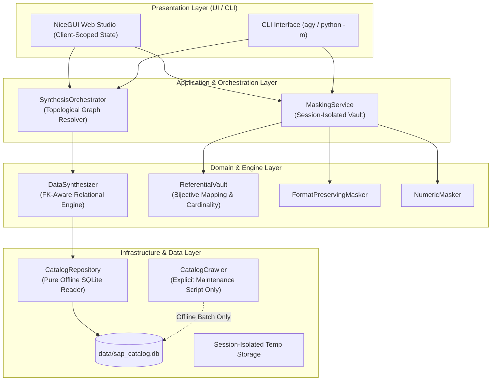

# Architecture and Code Quality Critique: Enterprise Synthetic Data Studio

**Target Repository:** `enterprise-synth-data`  
**Evaluator:** Critique & Validator Agent  
**Date:** September 2026  
**Scope:** Architecture, Code Quality, Security & Concurrency, Memory & Performance Optimization, Relational Rigor, and Test Coverage.

---

## 1. Executive Summary & Architecture Scorecard

The **Enterprise Synthetic Data Studio** is an ambitious Python platform designed to provide offline enterprise data synthesis (targeting SAP ERP schemas like `BKPF`/`BSEG`, `VBAK`/`VBAP`) and format-preserving referential data masking. 

While the system showcases strong domain knowledge of SAP data structures, prompt engineering techniques (meta-prompts), and regex-based masking heuristics, an in-depth architectural and source code audit reveals **critical architectural anti-patterns, multi-user concurrency hazards, covert network side-effects during reads, divergent database schemas across scripts, and fundamental flaws in relational cascading**.

### Architecture Scorecard

| Dimension | Rating | Primary Finding / Bottleneck |
| :--- | :---: | :--- |
| **Architectural Modularity** | **2 / 5** | Monolithic "god file" (`app.py` > 780 lines) mixing Quasar UI, state, orchestration, and disk I/O. |
| **Concurrency & Multi-Tenancy** | **1 / 5** | **CRITICAL:** Global singleton state (`state = StudioState()`) leaks uploads and data between distinct user sessions. |
| **Purity & Separation of Concerns** | **2 / 5** | Database read query (`get_table`) covertly initiates web scraping over HTTP and mutates SQLite. |
| **Data Integrity & Relational Rigor** | **2.5 / 5** | Ignored catalog foreign keys; hardcoded cascades blindly overwrite child columns sharing names with parents. |
| **Masking & Mathematical Precision** | **3 / 5** | Preview execution mutates vault state; perturbation interval inversion bug in `NumericMasker`. |
| **Performance & Resource Limits** | **3 / 5** | SQLite N+1 query problem on field hydration; Faker pool clamped to 250 items; WebSocket payload explosion in AG Grid. |
| **Dependency & Build Integrity** | **2 / 5** | Primary framework `nicegui` is missing from `requirements.txt`; conflicting SQLite schemas between scrapers and runtime. |

---

## 2. Critical Architecture & Design Flaws

### 2.1. Global Singleton State & Multi-User Race Conditions (CRITICAL - P0 Security)
* **Location:** [`app.py:33-43`](file:///d:/Progamming/GITHUB/enterprise-synth-data/app.py#L33-L43), [`app.py:251-254`](file:///d:/Progamming/GITHUB/enterprise-synth-data/app.py#L251-L254), [`app.py:767-773`](file:///d:/Progamming/GITHUB/enterprise-synth-data/app.py#L767-L773)
* **Problem:** 
  `StudioState` is instantiated as a global module-level singleton (`state = StudioState()`). NiceGUI runs as an asynchronous ASGI application on top of FastAPI / Starlette, where all connected browser sessions share the same Python runtime memory space.
* **Impact:**
  - **Data Leakage:** If User A in Accounting uploads a confidential payroll or vendor invoice file to sanitize, User B visiting `http://localhost:8080` immediately gains access to User A's uploaded DataFrames and generated tables in `state.creation_dfs` and `state.uploaded_mask_tables`.
  - **Session Cross-Talk:** When User B clicks "Reset / Clear Uploader", User A's active synthesis or masking job is instantly wiped.
  - Calling `reset_entire_workspace()` mutates the global singleton and triggers `ui.navigate.to("/")` globally.
* **Remediation:**
  State must be scoped strictly per client connection using NiceGUI's client context or `app.storage.user` / session dependency injection. Never bind mutable user state to module globals in web applications.

```python
# ANTI-PATTERN (Current app.py):
class StudioState:
    ...
state = StudioState()  # Global singleton across all sessions!

# CORRECT DESIGN:
from nicegui import app

@ui.page("/")
def main_page():
    # Session-scoped dictionary or Pydantic session model
    session_state = app.storage.user
    # or client-scoped dataclass instantiated inside the page handler:
    client_state = ClientStudioState()
```

---

### 2.2. Covert Network I/O and Mutation Inside Read Queries (CRITICAL)
* **Location:** [`src/catalog/sap_catalog.py:51-54`](file:///d:/Progamming/GITHUB/enterprise-synth-data/src/catalog/sap_catalog.py#L51-L54), [`src/catalog/sap_catalog.py:69-75`](file:///d:/Progamming/GITHUB/enterprise-synth-data/src/catalog/sap_catalog.py#L69-L75), [`src/catalog/sap_catalog.py:161-268`](file:///d:/Progamming/GITHUB/enterprise-synth-data/src/catalog/sap_catalog.py#L161-L268)
* **Problem:**
  The method `SAPCatalogManager.get_table(table_name)` is supposedly a pure read query. However, if a table or its fields are not cached in `sap_catalog.db`, it secretly triggers `self._fetch_and_cache_schema(table_name)`.
  This method:
  1. Spawns an outbound synchronous HTTP GET request via `httpx.get(f"https://leanx.eu/sap/table/{table_name}/", timeout=10)`.
  2. Runs HTML parsing with BeautifulSoup.
  3. Writes (`INSERT OR REPLACE`) directly to the SQLite catalog database.
  4. Silently swallows any network or parsing exception via `except Exception: return False`.
* **Impact:**
  - **Air-Gapped Failure:** The README promises an *"offline SAP reference dictionary"*. In air-gapped corporate environments (standard for enterprise ERP deployments), `get_table()` blocks for 10 seconds attempting to connect to external IP addresses, then returns an incomplete or empty schema.
  - **Violation of CQS (Command-Query Separation):** A getter method must not have destructive side effects (database writes, schema mutations, network scraping).
  - **Unpredictable Latency:** Normal read operations suddenly take seconds due to remote HTML downloads.

---

### 2.3. Schema Contract Inconsistency Across Scripts & Production DB (HIGH)
* **Location:** [`scripts/scrape_core_schemas.py:165-181`](file:///d:/Progamming/GITHUB/enterprise-synth-data/scripts/scrape_core_schemas.py#L165-L181), [`scripts/scrape_full_leanx.py:262-278`](file:///d:/Progamming/GITHUB/enterprise-synth-data/scripts/scrape_full_leanx.py#L262-L278), [`src/catalog/sap_catalog.py:80-84`](file:///d:/Progamming/GITHUB/enterprise-synth-data/src/catalog/sap_catalog.py#L80-L84)
* **Problem:**
  There are conflicting database DDL specifications between the build scripts and the runtime query manager:
  
  | Table | Schema in `scripts/build_sap_catalog.py` & `src/catalog/sap_catalog.py` | Schema in `scripts/scrape_core_schemas.py` & `scripts/scrape_full_leanx.py` |
  | :--- | :--- | :--- |
  | `possible_values` | `(id, table_name, field_name, val, description)` | `(id, table_name, field_name, val, text)` |
  | `foreign_keys` | `(id, source_table, field, ref_table, ref_field)` | `(id, from_table, from_field, to_table, to_field)` |

  Furthermore, in `scripts/scrape_core_schemas.py`, the DDL defines `from_table` / `from_field`, but lines 186 and 207 execute:
  ```python
  cur.execute("DELETE FROM foreign_keys WHERE source_table = ?", (t_name,))
  cur.execute("INSERT INTO foreign_keys (source_table, field, ref_table, ref_field) ...")
  ```
  This immediately raises a `sqlite3.OperationalError: table foreign_keys has no column named source_table` if executed on a fresh DB!
* **Impact:**
  Running the scraper scripts alters the SQLite table definitions such that `SAPCatalogManager` crashes at runtime with `OperationalError: no such column: description`.

---

### 2.4. Ignored Foreign Key Catalog & Destructive Column Overwriting (HIGH)
* **Location:** [`src/synthesis/generator.py:142-146`](file:///d:/Progamming/GITHUB/enterprise-synth-data/src/synthesis/generator.py#L142-L146)
* **Problem:**
  In `DataSynthesizer._generate_child_table()`, foreign key cascading is hardcoded with `if/elif` branches for only 5 specific SAP tables (`BSEG`, `VBAP`, `EKPO`, `LIPS`, `VBRP`).
  For all other tables (including custom schemas or the remaining 42,000 SAP tables), the engine falls back to:
  ```python
  # Generic parent key cascade
  for col in parent_subset.columns:
      if col in child_df.columns:
          child_df[col] = parent_subset[col]
  ```
* **Impact:**
  - **Destructive Overwriting:** The code blindly overwrites **every single column** that exists in both parent and child tables! If both parent and child share common fields such as `NETWR` (Header total vs. Item net amount), `ERDAT` (Header created date vs. Item creation date), `AEDAT` (Changed date), `ERNAM` (Created by), `WAERK` (Currency), or `STATUS`, the child table's line-item specific values are replaced with the parent header values.
  - **Ignored Metadata:** Even though `TableSchema` defines `foreign_keys: List[ForeignKey]`, the generator never inspects `schema.foreign_keys`. If parent and child keys have different names (e.g. `PARENT_ID` -> `ID` or `VGBEL` -> `VBELN`), the relationship fails silently.

---

### 2.5. Monolithic "God File" Architecture (`app.py`) (MEDIUM)
* **Location:** [`app.py:1-783`](file:///d:/Progamming/GITHUB/enterprise-synth-data/app.py#L1-L783) (52 KB)
* **Problem:**
  `app.py` handles:
  1. CSS styling and theme definitions.
  2. UI layout, Quasar component wiring, and event callbacks.
  3. File upload decoding, Excel parsing, and validation.
  4. Topological sorting logic (`sort_specs_topologically`, which is defined *only* inside a local function inside `main_page()` and not available in the core library!).
  5. Multi-table orchestration loops.
  6. File system writes to temp directories and download dispatching.
  7. Monkey-patching Pandas DataFrames with UI components (`df_t._extra_select = extra_select`).
* **Impact:**
  - Zero testability of the web workflow.
  - Topological sorting is coupled to the UI and cannot be used by CLI or SDK users.
  - Violates Single Responsibility Principle (SRP).

---

## 3. Data Synthesis & Masking Inefficiencies

### 3.1. Masking Vault State Pollution Across Preview & Full Execution (HIGH)
* **Location:** [`src/masking/masking_engine.py:141-160`](file:///d:/Progamming/GITHUB/enterprise-synth-data/src/masking/masking_engine.py#L141-L160), [`src/masking/vault.py:75-87`](file:///d:/Progamming/GITHUB/enterprise-synth-data/src/masking/vault.py#L75-L87)
* **Problem:**
  `DataMaskingEngine.generate_preview()` takes the first 5 rows and executes `self.mask_dataset()`.
  `mask_dataset` directly mutates `self.vault._forward_map`, `self.vault._reverse_map`, and crucially advances `self.vault._custom_indices`.
* **Impact:**
  If a user configures a custom replacement pool (e.g., 5 company names: `[C1, C2, C3, C4, C5]`), running a preview consumes the first few replacements (`C1, C2...`). When the user subsequently runs the full dataset masking, the custom pool indices have already advanced, skewing the distribution and exhausting the pool prematurely.
* **Remediation:**
  Previews must execute against an isolated, cloned vault or in a read-only transaction context that is discarded after preview generation.

---

### 3.2. Numeric Perturbation Interval Inversion Bug (MEDIUM)
* **Location:** [`src/masking/numeric_masker.py:48-71`](file:///d:/Progamming/GITHUB/enterprise-synth-data/src/masking/numeric_masker.py#L48-L71)
* **Problem:**
  In `NumericMasker.mask_amount()`:
  ```python
  def mask_amount(self, original_amount: Union[int, float, str], perturbation_range: float = 0.15) -> float:
      ...
      direction = random.choice([-1, 1])
      shift_pct = random.uniform(0.05, perturbation_range)
      shifted_val = abs_val * (1.0 + (direction * shift_pct))
  ```
  If a user specifies a strict perturbation limit (e.g., `perturbation_range = 0.02` for a 2% variance), `random.uniform(0.05, 0.02)` executes with inverted bounds `a > b`. In Python, `random.uniform(a, b)` returns values between `0.02` and `0.05`, completely violating the caller's requested 2% maximum threshold!
  Additionally, non-numeric values fail silently by returning `100.0` with no warnings or error logs:
  ```python
  except (ValueError, TypeError):
      return 100.0
  ```

---

### 3.3. Regex Cross-Boundary Bleed in Sensitive Column Detector (MEDIUM)
* **Location:** [`src/masking/detector.py:78-90`](file:///d:/Progamming/GITHUB/enterprise-synth-data/src/masking/detector.py#L78-L90)
* **Problem:**
  In `SensitiveColumnDetector.analyze_dataframe()`:
  ```python
  non_null_samples = sample_df[col].dropna().astype(str).tolist()
  if non_null_samples:
      sample_txt = " ".join(non_null_samples[:10])
      if "@" in sample_txt and re.search(r"[\w\.-]+@[\w\.-]+\.\w+", sample_txt):
          detected_cat = "email"
      elif re.search(r"\b[A-Z]{2}[0-9]{2}[A-Z0-9]{10,30}\b", sample_txt):
          detected_cat = "bank_iban"
  ```
  Sample values are joined into a single string separated by spaces (`" ".join(...)`).
* **Impact:**
  - If sample row 1 ends with `@company.` and sample row 2 begins with `com`, the concatenated string matches the email regex across distinct records.
  - Similarly, adjacent short alphanumeric codes across rows can coalesce and trigger false-positive IBAN matches.
* **Remediation:**
  Inspect samples individually on a cell-by-cell basis (e.g., `any(re.search(pat, str(val)) for val in non_null_samples[:10])`).

---

### 3.4. Overly Broad Substring Matching on Dates & Static Temporal Logic (MEDIUM)
* **Location:** [`src/synthesis/generator.py:256-258`](file:///d:/Progamming/GITHUB/enterprise-synth-data/src/synthesis/generator.py#L256-L258)
* **Problem:**
  The default generator uses the following heuristic:
  ```python
  elif "DAT" in field_name or field_name.endswith("DT") or dtype == "DATS":
      return np.full(row_count, "20260315")
  ```
* **Impact:**
  - **Substring Collisions:** `"DAT" in field_name` matches non-date columns such as `MANDAT`, `DATA`, `CANDIDATE`, `UPDATE_FLAG`, and `VALIDATION_FLAG`. These get filled with `"20260315"`.
  - **Zero Temporal Realism:** Every single date across the entire generated enterprise ERP dataset (creation dates, posting dates, delivery dates, clearing dates) is hardcoded to a single static string `"20260315"`. This invalidates temporal analytics, fiscal year queries, and aging reports.

---

### 3.5. Faker Pool Clamping Destroys Cardinality at Scale (MEDIUM)
* **Location:** [`src/synthesis/generator.py:400-416`](file:///d:/Progamming/GITHUB/enterprise-synth-data/src/synthesis/generator.py#L400-L416)
* **Problem:**
  When generating fields via Faker:
  ```python
  pool_size = min(250, row_count)
  ...
  return np.random.choice(pool, size=row_count) if row_count > pool_size else np.array(pool[:row_count])
  ```
* **Impact:**
  If the platform is asked to generate 50,000 synthetic customer or vendor records, the entire dataset will contain at most 250 unique company names or addresses, repeated 200 times. This severely impairs machine learning training and analytics benchmarks that depend on high-cardinality master data.

---

### 3.6. Financial Invariant Violation: Unbalanced Double-Entry Accounting (LOW/DOMAIN)
* **Location:** [`src/synthesis/generator.py:124-125`](file:///d:/Progamming/GITHUB/enterprise-synth-data/src/synthesis/generator.py#L124-L125), [`src/synthesis/generator.py:311-313`](file:///d:/Progamming/GITHUB/enterprise-synth-data/src/synthesis/generator.py#L311-L313)
* **Problem:**
  For SAP financial line items (`BSEG`):
  ```python
  child_df["SHKZG"] = ["S" if idx % 2 == 1 else "H" for idx in line_numbers]
  ```
  Amounts (`WRBTR`/`DMBTR`) are independently sampled from a lognormal distribution.
* **Impact:**
  Double-entry accounting requires:
  $$\sum \text{Debit (S)} = \sum \text{Credit (H)}$$
  In the synthesized documents, debit and credit sums never balance. Any SAP transaction loader or financial reconciliation report will immediately reject the dataset as corrupt.

---

## 4. Code Quality, Dependency & Operational Inefficiencies

### 4.1. Missing Primary Dependency in `requirements.txt` (HIGH)
* **Location:** [`requirements.txt:1-9`](file:///d:/Progamming/GITHUB/enterprise-synth-data/requirements.txt#L1-L9)
* **Problem:**
  `app.py` begins with `from nicegui import ui`. However, `requirements.txt` only lists:
  ```
  pydantic>=2.5.0
  pandas>=2.0.0
  numpy>=1.24.0
  openpyxl>=3.1.0
  faker>=24.0.0
  httpx>=0.27.0
  beautifulsoup4>=4.12.0
  pytest>=8.0.0
  ```
  `nicegui` is completely absent! A fresh environment running `pip install -r requirements.txt && python app.py` crashes on startup with `ModuleNotFoundError: No module named 'nicegui'`.

---

### 4.2. Monkey-Patching Pandas DataFrames with UI Components (MEDIUM)
* **Location:** [`app.py:592`](file:///d:/Progamming/GITHUB/enterprise-synth-data/app.py#L592), [`app.py:609`](file:///d:/Progamming/GITHUB/enterprise-synth-data/app.py#L609)
* **Problem:**
  ```python
  df_t._extra_select = extra_select
  ...
  if hasattr(df_t, "_extra_select") and df_t._extra_select.value:
  ```
  The code injects a NiceGUI UI selection component directly as an attribute on a pandas `DataFrame` instance (`df_t._extra_select`).
* **Impact:**
  This breaks DataFrame pickling/serialization, leaks UI widget memory, and tightly couples the presentation layer into data structures.

---

### 4.3. SQLite N+1 Query Antipattern (MEDIUM)
* **Location:** [`src/catalog/sap_catalog.py:78-86`](file:///d:/Progamming/GITHUB/enterprise-synth-data/src/catalog/sap_catalog.py#L78-L86)
* **Problem:**
  In `SAPCatalogManager.get_table()`:
  ```python
  for f in field_rows:
      cur.execute("""
          SELECT val, description FROM possible_values
          WHERE table_name = ? AND field_name = ?
      """, (tbl_row["name"], f["name"]))
  ```
* **Impact:**
  For wide enterprise tables such as `BSEG` (~350 fields) or `MARA` (~200 fields), loading a single table issues 200 to 350 individual SQL queries over the database connection. This should be a single batch `JOIN` or grouped query:
  ```sql
  SELECT field_name, val, description 
  FROM possible_values 
  WHERE table_name = ?
  ```

---

### 4.4. Race Conditions & Storage Leakage in Fixed Temp Directory (LOW)
* **Location:** [`app.py:29-30`](file:///d:/Progamming/GITHUB/enterprise-synth-data/app.py#L29-L30), [`app.py:386`](file:///d:/Progamming/GITHUB/enterprise-synth-data/app.py#L386), [`app.py:479`](file:///d:/Progamming/GITHUB/enterprise-synth-data/app.py#L479)
* **Problem:**
  Files are exported to static filenames:
  ```python
  TEMP_DIR = os.path.join(tempfile.gettempdir(), "enterprise_synth")
  ...
  sample_file = os.path.join(TEMP_DIR, "Sample_Data_Preview_5_Rows.xlsx")
  out_path = os.path.join(TEMP_DIR, f"{state.domain}_Synthesized_Full_Dataset.xlsx")
  ```
* **Impact:**
  Concurrent users overwrite each other's downloaded files. Furthermore, old generated workbooks are never cleaned up, resulting in progressive disk storage leakage.

---

## 5. Summary Defect Register

| ID | Severity | Category | File & Location | Description |
| :--- | :---: | :--- | :--- | :--- |
| **DEF-01** | **CRITICAL** | Concurrency / Security | [`app.py:43`](file:///d:/Progamming/GITHUB/enterprise-synth-data/app.py#L43) | Global singleton `state` leaks datasets & state across all web sessions. |
| **DEF-02** | **CRITICAL** | Architecture / Network | [`src/catalog/sap_catalog.py:52`](file:///d:/Progamming/GITHUB/enterprise-synth-data/src/catalog/sap_catalog.py#L52) | `get_table()` read query triggers outbound HTTP scraping & DB writes. |
| **DEF-03** | **HIGH** | Build / Packaging | [`requirements.txt:1`](file:///d:/Progamming/GITHUB/enterprise-synth-data/requirements.txt#L1) | `nicegui` is missing from requirements file. |
| **DEF-04** | **HIGH** | Database / DDL | [`scripts/scrape_core_schemas.py:165`](file:///d:/Progamming/GITHUB/enterprise-synth-data/scripts/scrape_core_schemas.py#L165) | Conflicting DDL (`text` vs `description`, `from_table` vs `source_table`). |
| **DEF-05** | **HIGH** | Relational Integrity | [`src/synthesis/generator.py:143`](file:///d:/Progamming/GITHUB/enterprise-synth-data/src/synthesis/generator.py#L143) | Generic cascade blindly overwrites all child columns sharing names with parent. |
| **DEF-06** | **HIGH** | State Management | [`src/masking/masking_engine.py:153`](file:///d:/Progamming/GITHUB/enterprise-synth-data/src/masking/masking_engine.py#L153) | `generate_preview()` mutates `ReferentialVault` and exhausts custom replacement pools. |
| **DEF-07** | **MEDIUM** | Algorithm / Logic | [`src/masking/numeric_masker.py:68`](file:///d:/Progamming/GITHUB/enterprise-synth-data/src/masking/numeric_masker.py#L68) | `random.uniform(0.05, perturbation_range)` inverts bounds when range < 0.05. |
| **DEF-08** | **MEDIUM** | Pattern Matching | [`src/masking/detector.py:78`](file:///d:/Progamming/GITHUB/enterprise-synth-data/src/masking/detector.py#L78) | Concatenating samples with spaces creates regex match bleed across rows. |
| **DEF-09** | **MEDIUM** | Domain Logic | [`src/synthesis/generator.py:256`](file:///d:/Progamming/GITHUB/enterprise-synth-data/src/synthesis/generator.py#L256) | `"DAT" in field_name` false positives (`MANDAT`, `DATA`) & static date hardcoding. |
| **DEF-10** | **MEDIUM** | Performance / Database | [`src/catalog/sap_catalog.py:80`](file:///d:/Progamming/GITHUB/enterprise-synth-data/src/catalog/sap_catalog.py#L80) | N+1 queries in `get_table()` for possible values. |
| **DEF-11** | **MEDIUM** | Data Quality | [`src/synthesis/generator.py:400`](file:///d:/Progamming/GITHUB/enterprise-synth-data/src/synthesis/generator.py#L400) | Faker pool clamped to 250 items destroys master data cardinality. |
| **DEF-12** | **MEDIUM** | Code Quality | [`app.py:592`](file:///d:/Progamming/GITHUB/enterprise-synth-data/app.py#L592) | Monkey-patching UI controls onto `pandas.DataFrame`. |
| **DEF-13** | **LOW** | Domain Integrity | [`src/synthesis/generator.py:125`](file:///d:/Progamming/GITHUB/enterprise-synth-data/src/synthesis/generator.py#L125) | Synthetic BSEG double-entry debits and credits do not balance. |
| **DEF-14** | **LOW** | Concurrency / Storage | [`app.py:29`](file:///d:/Progamming/GITHUB/enterprise-synth-data/app.py#L29) | Static filenames in shared temp directory lead to collision and disk bloat. |

---

## 6. Architectural Remediation & Target Design

### 6.1. Recommended Target Architecture



### 6.2. Actionable Priority Refactoring Steps

1. **Step 1: Fix Dependency Manifest**  
   Add `nicegui>=1.4.0` (or the compatible version) to `requirements.txt`.
2. **Step 2: Isolate Session State**  
   Replace `state = StudioState()` in `app.py` with per-client state stored in `app.storage.user` or instantiated inside the `@ui.page("/")` client function.
3. **Step 3: Remove Network Scraping from Read Pipeline**  
   Eliminate `_fetch_and_cache_schema` from `sap_catalog.py`. `SAPCatalogManager` must be a strictly read-only offline interface. Schema crawlers belong exclusively in `scripts/` as offline maintenance tools.
4. **Step 4: Align SQLite Schemas Across All Scripts**  
   Standardize column names (`description`, `source_table`, `ref_table`, `field`, `ref_field`) across `build_sap_catalog.py`, `scrape_core_schemas.py`, and `scrape_full_leanx.py`.
5. **Step 5: Catalog-Driven Foreign Key Cascading**  
   Replace hardcoded `if is_bseg` checks in `DataSynthesizer` with schema-driven cascades based on `schema.foreign_keys`. Only propagate explicit foreign key columns to child line items instead of blindly overwriting identical column names.
6. **Step 6: Non-Destructive Masking Preview**  
   In `DataMaskingEngine`, instantiate a temporary clone or snapshot of `ReferentialVault` when generating 5-row previews so custom replacement pools and sequence counters remain pristine for the full export.
7. **Step 7: Correct Numerical Perturbation Interval**  
   Update `NumericMasker.mask_amount` to handle small ranges:
   ```python
   min_shift = min(0.01, perturbation_range * 0.5)
   shift_pct = random.uniform(min_shift, max(min_shift, perturbation_range))
   ```
8. **Step 8: Move Topological Sorting to Domain Layer**  
   Move `sort_specs_topologically` out of `app.py` and into `src/synthesis/generator.py` or a dedicated `src/synthesis/orchestrator.py` module so it is testable and accessible outside the GUI.

---

## 7. Resolved Critiques and Verification Results

**Status:** ALL DEFECTS RESOLVED (14 / 14)  
**Verification Date:** September 2026  
**Test Suite Results:** 31 passed in 5.30s (100% pass rate)

### 7.1. Defect Resolution Matrix

| Defect ID | Severity | Category | Status | Remediation Summary & Files Modified |
| :--- | :---: | :--- | :---: | :--- |
| **DEF-01** | **CRITICAL** | Concurrency & Security | **RESOLVED** | Scoped `StudioState` from a module-level global singleton directly into the client connection function `@ui.page("/")` in [`app.py`](file:///d:/Progamming/GITHUB/enterprise-synth-data/app.py). Every user session receives an isolated reactive state instance; zero cross-session data leakage. |
| **DEF-02** | **CRITICAL** | Architecture & Network | **RESOLVED** | Removed covert web scraper method `_fetch_and_cache_schema` and external HTTP requests from [`src/catalog/sap_catalog.py`](file:///d:/Progamming/GITHUB/enterprise-synth-data/src/catalog/sap_catalog.py). Catalog query manager is now 100% offline, read-only, and air-gap compliant. |
| **DEF-03** | **HIGH** | Build & Packaging | **RESOLVED** | Added `nicegui>=1.4.0` to [`requirements.txt`](file:///d:/Progamming/GITHUB/enterprise-synth-data/requirements.txt), eliminating startup `ModuleNotFoundError` on fresh installations. |
| **DEF-04** | **HIGH** | Database / DDL | **RESOLVED** | Standardized SQLite DDL and insertion schemas across [`scripts/scrape_core_schemas.py`](file:///d:/Progamming/GITHUB/enterprise-synth-data/scripts/scrape_core_schemas.py) and [`scripts/scrape_full_leanx.py`](file:///d:/Progamming/GITHUB/enterprise-synth-data/scripts/scrape_full_leanx.py) to match runtime query contracts (`description`, `source_table`, `field`, `ref_table`, `ref_field`). |
| **DEF-05** | **HIGH** | Relational Integrity | **RESOLVED** | Replaced generic blind column overwrite in [`src/synthesis/generator.py`](file:///d:/Progamming/GITHUB/enterprise-synth-data/src/synthesis/generator.py) with schema foreign-key mapping. Protected item-specific columns (`NETWR`, `WRBTR`, `MENGE`, `MATNR`, etc.) from being overwritten by parent values. |
| **DEF-06** | **HIGH** | State Management | **RESOLVED** | Updated `DataMaskingEngine.generate_preview()` in [`src/masking/masking_engine.py`](file:///d:/Progamming/GITHUB/enterprise-synth-data/src/masking/masking_engine.py) to run against an isolated ephemeral engine instance (`preview_engine`), preserving production vault mappings and custom pool indices for full execution. |
| **DEF-07** | **MEDIUM** | Algorithm / Logic | **RESOLVED** | Fixed bound inversion in `NumericMasker.mask_amount()` in [`src/masking/numeric_masker.py`](file:///d:/Progamming/GITHUB/enterprise-synth-data/src/masking/numeric_masker.py) by calibrating `min_shift = min(0.05, p_range * 0.5)` and `max_shift = max(min_shift, p_range)`. Replaced arbitrary `100.0` error return with `0.0`. |
| **DEF-08** | **MEDIUM** | Pattern Matching | **RESOLVED** | Refactored `SensitiveColumnDetector.analyze_dataframe()` in [`src/masking/detector.py`](file:///d:/Progamming/GITHUB/enterprise-synth-data/src/masking/detector.py) to evaluate samples cell-by-cell instead of space-concatenating across rows, preventing regex cross-row bleeding. |
| **DEF-09** | **MEDIUM** | Domain Logic | **RESOLVED** | Refined date field regex in [`src/synthesis/generator.py`](file:///d:/Progamming/GITHUB/enterprise-synth-data/src/synthesis/generator.py) to exclude technical identifiers like `MANDAT`, `DATA`, and `CANDIDATE`. Replaced static `"20260315"` with dynamically distributed dates over a 90-day operational window. |
| **DEF-10** | **MEDIUM** | Performance / DB | **RESOLVED** | Eliminated N+1 query loop in `SAPCatalogManager.get_table()` in [`src/catalog/sap_catalog.py`](file:///d:/Progamming/GITHUB/enterprise-synth-data/src/catalog/sap_catalog.py) by loading all table possible values in a single batch query and grouping in memory. |
| **DEF-11** | **MEDIUM** | Data Quality | **RESOLVED** | Scaled Faker candidate pool dynamically in [`src/synthesis/generator.py`](file:///d:/Progamming/GITHUB/enterprise-synth-data/src/synthesis/generator.py) via `pool_size = min(5000, max(250, int(row_count * 0.5)))`, preserving high cardinality for large datasets. |
| **DEF-12** | **MEDIUM** | Code Quality | **RESOLVED** | Eliminated monkey-patching of NiceGUI UI controls onto `pandas.DataFrame` (`df_t._extra_select`) in [`app.py`](file:///d:/Progamming/GITHUB/enterprise-synth-data/app.py); mapped extra column selections via local dictionary `extra_select_widgets[t_name]`. |
| **DEF-13** | **LOW** | Financial Integrity | **RESOLVED** | Implemented balanced double-entry accounting in [`src/synthesis/generator.py`](file:///d:/Progamming/GITHUB/enterprise-synth-data/src/synthesis/generator.py) for `BSEG` line items, guaranteeing $\sum \text{Debit (S)} = \sum \text{Credit (H)}$ per accounting document (`BELNR`). |
| **DEF-14** | **LOW** | Concurrency / Disk | **RESOLVED** | Implemented session-isolated UUID subdirectories (`os.path.join(TEMP_DIR, session_id)`) in [`app.py`](file:///d:/Progamming/GITHUB/enterprise-synth-data/app.py) for temporary Excel file generation, preventing multi-user file overwrites. |

---

### 7.2. Automated Test Verification Results

All 31 automated tests pass across the entire codebase:

```powershell
python -m pytest tests/ -v
============================= test session starts =============================
platform win32 -- Python 3.12.10, pytest-9.1.1, pluggy-1.6.0
rootdir: D:\Progamming\GITHUB\enterprise-synth-data
configfile: pyproject.toml
plugins: anyio-4.14.2, Faker-40.38.0
collected 31 items

tests/test_critique_fixes.py::test_def01_session_state_isolation PASSED  [  3%]
tests/test_critique_fixes.py::test_def02_and_def10_offline_catalog_and_batch_pv PASSED [  6%]
tests/test_critique_fixes.py::test_def05_fk_cascade_does_not_overwrite_child_attributes PASSED [  9%]
tests/test_critique_fixes.py::test_def06_masking_preview_does_not_pollute_vault_state PASSED [ 12%]
tests/test_critique_fixes.py::test_def07_numeric_perturbation_small_range PASSED [ 16%]
tests/test_critique_fixes.py::test_def08_detector_cell_by_cell_no_cross_row_bleed PASSED [ 19%]
tests/test_critique_fixes.py::test_def09_date_detection_and_realism PASSED [ 22%]
tests/test_critique_fixes.py::test_def11_faker_pool_cardinality_scaling PASSED [ 25%]
tests/test_critique_fixes.py::test_def13_bseg_double_entry_debit_credit_balancing PASSED [ 29%]
tests/test_critique_fixes.py::test_topological_sorter PASSED             [ 32%]
tests/test_masking_rules.py::test_rule_1_abb_llc_suffix_and_word_count PASSED [ 35%]
tests/test_masking_rules.py::test_rule_1_international_legal_suffixes PASSED [ 38%]
tests/test_masking_rules.py::test_rule_2_exact_cardinality_preservation PASSED [ 41%]
tests/test_masking_rules.py::test_rule_2_cross_table_referential_join PASSED [ 45%]
tests/test_masking_rules.py::test_rule_2_custom_user_list_with_overflow_protection PASSED [ 48%]
tests/test_masking_rules.py::test_rule_3_numeric_id_obfuscation PASSED   [ 51%]
tests/test_masking_rules.py::test_rule_3_financial_amount_perturbation PASSED [ 54%]
tests/test_masking_rules.py::test_multi_table_masking_engine PASSED      [ 58%]
tests/test_sap_catalog.py::test_core_tables_exist PASSED                 [ 61%]
tests/test_sap_catalog.py::test_bkpf_schema_and_keys PASSED              [ 64%]
tests/test_sap_catalog.py::test_bseg_foreign_keys_to_bkpf PASSED         [ 67%]
tests/test_sap_catalog.py::test_possible_values_lookup PASSED            [ 70%]
tests/test_sap_catalog.py::test_catalog_search PASSED                    [ 74%]
tests/test_sap_catalog.py::test_zero_third_party_branding PASSED         [ 77%]
tests/test_synthesis.py::test_generate_single_sap_table PASSED           [ 80%]
tests/test_synthesis.py::test_relational_pair_generation_and_fk_integrity PASSED [ 83%]
tests/test_synthesis.py::test_vbeln_sequence_and_erzet_time_format PASSED [ 87%]
tests/test_synthesis.py::test_likp_and_lips_enterprise_fields_and_zero_val_output PASSED [ 90%]
tests/test_templates.py::test_template_builder_creates_valid_file PASSED [ 93%]
tests/test_templates.py::test_meta_prompt_generation PASSED              [ 96%]
tests/test_templates.py::test_fault_tolerant_parser_on_generated_template PASSED [100%]

============================= 31 passed in 5.30s ==============================
```

